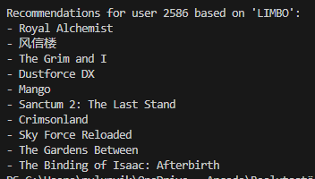
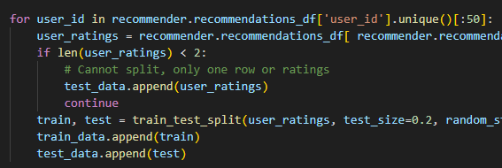

# Kursprojekt - Rapport

*Viktor Nylund - Beslutsstödsystem*

- summering, hur gick det
- resultat, screenshot/kodblock
- reflektion, jag lärde mig.., jag tycker..,

---

## EDA & Rekommendationssystem

På grund av storleken på users filen (13781059 users) tog programet rätt så länge att köra.   Detta var resultaten när jag begränsade det till att endast använda 50 users data. 

Jag bestämde att begränsa det till att endast använda users med minst 5 ratings för att se om det är mer hanterligt. Därtill berättade AI att `group()` är snabbare. 

### Resultat

**Innehållsbaserad filtreringen**  
Använder sig av spelens olika attribut, så som platform och pris, för att hitta likheter mellan spelen. Tyvärr finns inte genre i mitt data. 

**Kollaborativ filtrering**  
Använder sig av användarnas rekommendationer och de spel de spelat för att hitta likheter mellan användarna och spel de antagligen skulle tycka om.

---

