# Kursprojekt - Rapport

*Viktor Nylund - Beslutsstödsystem*

## Innehåll

- [Process](#process)
 - [Innehållsbaserad filtreringen](#innehållsbaserad-filtreringen)
 - [Kollaborativ filtrering](#kollaborativ-filtrering)
 - [Hybrid rekommendation](#hybrid-rekommendation)
- [Resultat](#resultat)
- [Evaluering](#evaluering)
- [Reflektion](#reflektion)

## Process

**Data:**  
[Dataset - Steam Games](https://www.kaggle.com/datasets/antonkozyriev/game-recommendations-on-steam/data).

### **Innehållsbaserad filtreringen**  
Använder sig av spelens olika attribut, så som platform och pris, för att hitta likheter mellan spelen. Tyvärr finns inte genre i mitt data. 

### **Kollaborativ filtrering**  
Använder sig av användarnas rekommendationer och de spel de spelat för att hitta likheter mellan användarna och spel de antagligen skulle tycka om.

Jag kombinerar dessa för att skapa ett hybridsystem som använder sig av båda faktorerna. Den innehållsbaserade listan sätts till med de kollaborativa rekommendationerna.
  
### **Hybrid rekommendation**

På grund av storleken på users filen (13781059 users) tog programet rätt så länge att köra.  
Detta var resultaten när jag begränsade det till att endast använda 50 users data. 

Jag bestämde att begränsa det till att använda users med minst 5 ratings för att se om det är mer hanterligt. 
Därtill berättade AI att programmet blir snabbare med `group()` och att använda en gläsare 'sparse' user-item matris med hjälp av `scipy.sparse`. Denna använder mindre minne och gör träningen snabbare. Jag lade även till `user_reviews, price_final och discount` till features i hopp om att de ger bättre resultat. 

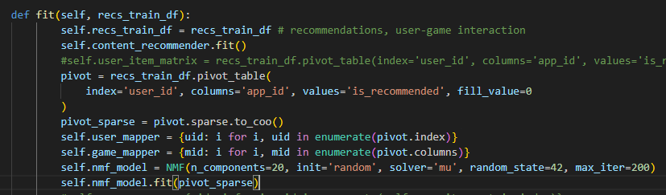

Jag bestämde också att helt enkelt minska datamängden direkt till ett par tusen. 
Men jag ville också hålla datan så autentisk som möjligt, och vill inte endast använda mig av de spel med flest rekommendationer. Även om det försämrar inlärning, ville jag att systemet inte skulle förlita sig helt på användare som rekommenderat många spel.  
Därför är 1/4 av den data jag använder mig av samplad på måfå, och den återstående andelen är användare med minst 5 rekommendationer.

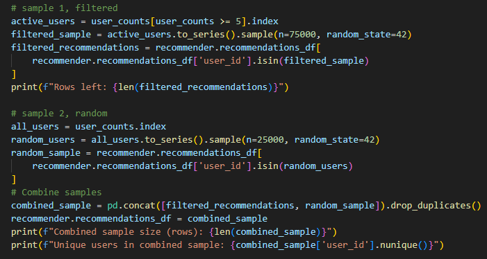

| Metric                  | Value      |
|-------------------------|------------|
| Användare               | 13,781,059 |
| >=5 rekommendationer    | 879,211    |
| Kombinerad data         | 952,526    |
| Unika användare         | 99,844     |

Det behövs evaluering för att veta säkert om detta är bättre eller inte. Det borde förbättra systemet ifall om användaren har väldigt få spel i sin lista. 

---

## Resultat

**Första Hybrid (halvt söndrig)**

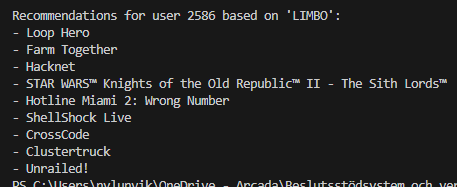

Förändringarna ovan gjorde programet mycket snabbare att köra. Det krävdes bara 2-3 minuter.  
Vid första anblick blir jag dock något oroad att rekommendationssystemet försämrats, men många av spelen i listan är obekanta för mig. 
T.ex. finns inte `The Binding of Isaac` kvar i listan, som var en passande rekommendation. `INSIDE`, uppföljaren, lyser även med sin frånvaro.  
AI menade att `discount` kan vara en vilseledande feature, så jag exkluderade den. Jag ändrade också andelen data som samplades på måfå från 1/4 till 1/6. Detta så att andelen slumpad data inte har för stor inverkan. Jag ökade även gränsen för ratings till minst 10 per användare, vilket krävde att jag minskade mängden använd data en aning.  
Resultatet var nära på det samma.

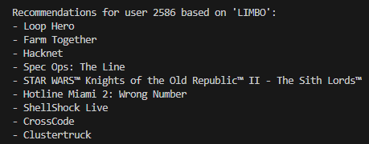

I detta skede modulariserade jag koden helt så att jag kunde köra båda funktionerna separat lättare.

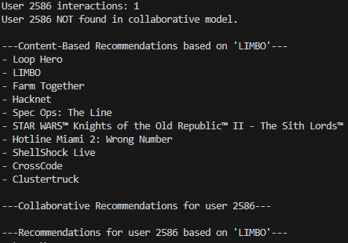

Här ser vi att användaren har väldigt få rader med rekommendationer. Användare `4616950` med 36 recensioner är bättre lämpad. Jag såg även till att manuellt sätta med användaren i mitt testdata. 

| Mått                   | Värde      | Förändring  |
|------------------------|------------|-------------|
| Användare              | 13,781,059 | -           |
| >=10 rekommendationer  | 1,276,399  | +397,188    |
| Kombinerad data        | 1,305,241  | +352,715    |
| Unika användare        | 69,961     | -29,883     |

**Innehållsbaserad rekommendation**

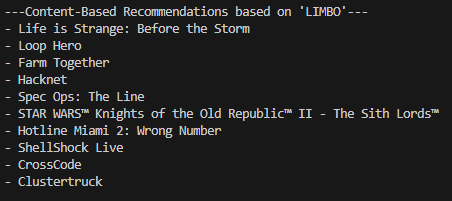

- Skillnaden beror endast på att det nu printar 10 rekommendationer, som det borde göra. Annars är 

**Kollaborativ rekommendation**

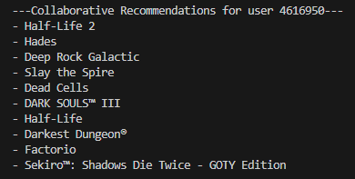

- Här ser vi helt andra typer av spel, som borde vara helt baserade på användarens tidigare recensioner. 

**Andra Hybrid (fixad)**

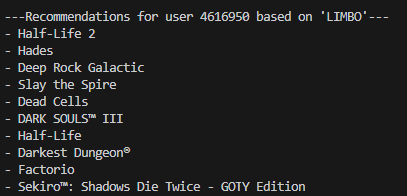

Här ser vi precis samma spel som i den kollaborativa filtreringen. Detta p.g.a. att denna lista lägs till först och de innehållsbaserade rekommendationerna lägs till därefter. Detta är en simpel hybrid model.  
AI gav detta som enkelt förslag på en viktad rekommenderare som "blandar" listorna.

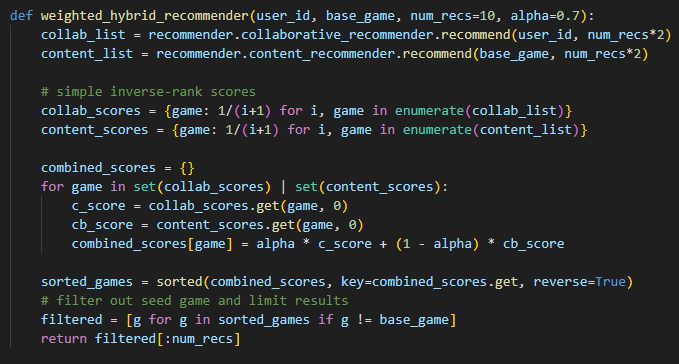

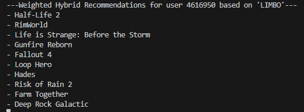

Här syns 7 nya spel, vilket är som förväntat från `alpha = 0.7`. 

## Evaluering

För evalueringen behövde jag öka antalet iterationer från 200 upp till 500 för att få bättre convergence. Träningen och evaluearingen tillsammans tog märkbart längre tid, nu över **2 timmar**.  
Jag övervägde att byta till `solver='cd'`, men den påstås vara mer lämpad för tät data utan stor variation. Det skulle alltså antagligen inte vara bättre, trots att den vore snabbare. `solver='mu'` är bättre lämpad för data som har "a lot of variety or sparsity".  
Enligt AI vore `init='nndsvda'` betydligt snabbare och också ge bättre rekommendationer. Därför böt jag till det och träningen tar nu .  
För att minska på träningstiden och evalueringen minskade jag mängden data ner till ~7k från 70k. 
Det tog nu endast 20 minuter.  
Jag behövde också fixa en bugg där jag fick Precision@k = 0,0% eftersom jag använda hela `recommendations_df` istället för bara `test_df`.

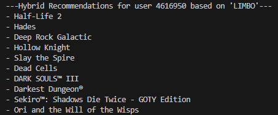

- Största delen av spelen är samma som tidigare, men den nya modellen har hittat 2 nya spel att rekommendera.

| Mått                   | Värde     | Förändring  |
|------------------------|-----------|-------------|
| Användare              | 13,781,059| -           |
| >=10 rekommendationer  | 130,365   | -1,146,034  |
| Kombinerad data        | 133,483   | -1,171,758  |
| Unika användare        | 7,001     | -62,960     |

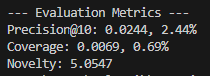

| Utvärdering    | Värde         |
|----------------|---------------|
| Precision@10   | 0.0244, 2.44% |
| Coverage       | 0.0069, 0.69% |
| Novelty        | 5.0547        |

**Precision@10**
- ~2,4% är ett väldigt lågt värde. Systemet rekommenderar sällan rekommenderar spel som användaren tyckt om. Modellen hade behövt tränas på ett större data.

**Coverage (täckning)**
- En täckning på ~0,7% är också mycket låg. Systemet rekommenderar endast ett litet antal populära spel utav bibliotekets alla spel. Det är typiskt för kollaborativ filtrering men modellen behöver helt klart större träningsdata.

**Novelty**
- Värdet ligger på medelnivån. Systemet rekommenderar till synes många spel förutom de mest populära. 

---

## Reflektion

Att modularisera koden var till hjälp för förståelsen av hur allt sitter ihop och hur systemet fungerar. 

Projektet var ett intressant sätt att slå ihop de senaste par projekten. Förstås hade det varit betydligt mer krävande ifall de uppgifterna inte hade gått så bra, men å andra sidan fick vi kod för det mesta förutom evalueringen.

Det hade ändå varit uppskattat att få någon som helst feedback på de sista par uppgifterna före kursprojektet, så att man lättare kunde lita på vad man åstadkommit dittills. 
